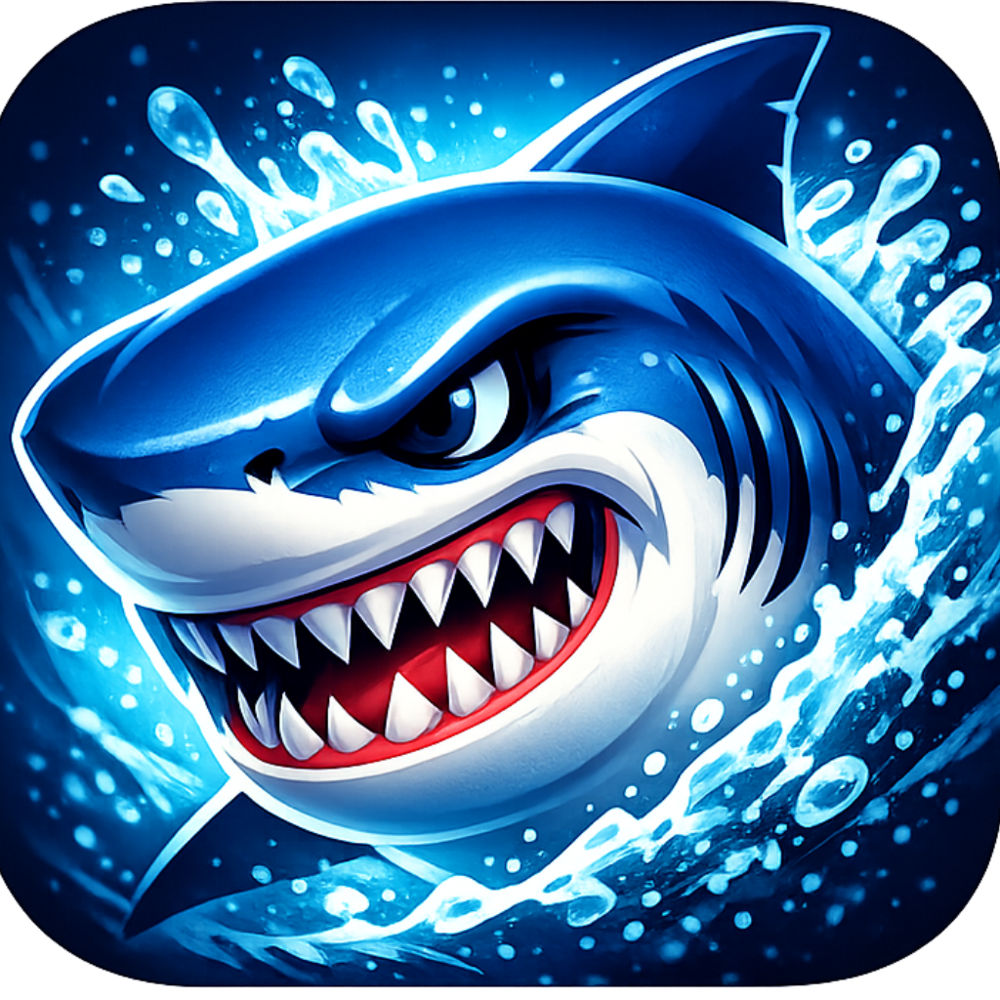

<p align="center">
  
</p>

<h1 align="center">Shark</h1>

<p align="center">
  An artificial intelligence made with HaxeFlixel.
</p>

## About

Shark is a HaxeFlixel application that brings a conversational AI directly into a game engine environment. It combines a chat interface, AI-driven image generation, a small collection of mini-games, and a fully mobile-ready UI into a single lightweight app, built entirely in Haxe.

The project is structured around a "brain" system (`Head`) that decides how to respond to user input — routing plain conversation through a chat backend, and image requests through a dedicated image generation pipeline — while keeping UI, networking, storage, audio, and performance concerns cleanly separated into their own systems.

## Features

- **Chat interface** with persistent conversation history (saved to disk and restored on launch), request queueing, and automatic retry with exponential backoff
- **AI image generation**, triggered either explicitly (`/image <description>`) or automatically when the AI embeds an image tag in its reply, with in-memory caching and automatic local saving
- **Mini-games**, accessible from the chat by typing `!play`:
  - **Bubble Pop** — pop rising bubbles before they escape
  - **Reef Runner** — an endless runner dodging obstacles
  - **Deep Dive** — descend while dodging falling rocks
- **Local image storage**, saving generated images as PNG files into a `content` folder in the app's private storage
- **Online/offline detection**, with a live status indicator, latency measurement, and a "run when back online" action queue
- **Persistent settings**, remembering mute state and volume between sessions
- **Ambient audio system**, with background music, sound effects, fades, and a global mute toggle
- **Mobile-first UI**, with touch-friendly controls, adaptive sizing, orientation handling, and Android back-button support
- **Aquatic visual theme**, with animated waves, light rays, kelp, and bubbles rendered entirely in HaxeFlixel
- **Runtime performance management**, adaptively scaling render quality and triggering garbage collection based on measured frame time and memory usage
- **Native C++ utilities** (on C++ targets) for fast math and native memory/GC control
- **Crash logging**, appending uncaught errors with build info to a local log file for later inspection
- **Cross-platform builds**: Windows, Android, and iOS (simulator), with automated CI via GitHub Actions

## Project Structure

```
Shark/
├── source/
│   ├── Main.hx                       Application entry point and lifecycle
│   ├── hxcpp/
│   │   └── CPP.hx                    Native C++ utilities (GC, memory, fast math)
│   ├── lime/
│   │   ├── Build.hx                  Programmatic build configuration (replaces Project.xml)
│   │   └── manager/
│   │       └── LimeManager.hx        Runtime platform detection & performance management
│   └── shark/
│       ├── active/
│       │   ├── GameState.hx          Mini-game selection screen
│       │   ├── games/
│       │   │   ├── BubblePopState.hx
│       │   │   ├── ReefRunnerState.hx
│       │   │   └── DeepDiveState.hx
│       │   └── system/
│       │       └── Head.hx           Core decision-making system ("the brain")
│       ├── audio/
│       │   └── Audio.hx              Music/SFX playback, volume, mute
│       ├── backend/
│       │   └── Paths.hx              Asset path resolution and caching
│       ├── functions/
│       │   ├── ChatEngine.hx         AI chat requests, queueing, retries, persistence
│       │   └── ImageCreator.hx       AI image generation, caching, auto-save
│       ├── menus/
│       │   └── MainMenuState.hx      Main menu and chat UI
│       ├── mobile/
│       │   └── StorageUtil.hx        Saves generated images to local storage
│       └── online/
│           ├── Online.hx             Connectivity polling
│           └── manager/
│               └── Internet.hx       High-level connectivity manager
├── assets/
│   └── images/
│       └── icon.png                  Application icon
├── Project.xml                       Lime/OpenFL project configuration
├── hmm.json                          Haxe dependency lockfile
└── .github/workflows/                CI build pipelines (Windows, Android, iOS)
```

## Requirements

- [Haxe](https://haxe.org/) 4.3.x
- [hmm](https://github.com/andywhite37/hmm) for dependency management
- [Lime](https://lime.software/) 8.3.2
- [HaxeFlixel](https://haxeflixel.com/) 5.9.0
- [hxcpp](https://github.com/HaxeFoundation/hxcpp) 4.3.2 (for native/C++ targets)

## Installation

Clone the repository:

```bash
git clone https://github.com/Brenninho123/Shark.git
cd Shark
```

Install dependencies with `hmm`:

```bash
haxelib install hmm
haxelib run hmm install
```

Set up Lime for your target platform:

```bash
haxelib run lime setup -y
```

## Configuration

Shark connects to an external API for chat and image generation. Before running the app, configure the endpoints and credentials, typically in `Main.hx` before the game window is created:

```haxe
shark.functions.ChatEngine.endpoint = "https://your-api-endpoint.com/chat";
shark.functions.ChatEngine.apiKey = "your-api-key";

shark.functions.ImageCreator.endpoint = "https://your-api-endpoint.com/image";
shark.functions.ImageCreator.apiKey = "your-api-key";
```

Other tunable settings include `ChatEngine.maxRetries`, `ChatEngine.maxHistory`, `ImageCreator.cacheEnabled`, `ImageCreator.autoSaveToStorage`, and `Online.checkInterval`.

## Building

**Windows:**

```bash
haxelib run lime build windows -final
```

**Android:**

```bash
haxelib run lime build android -final
```

**iOS (simulator):**

```bash
haxelib run lime build ios -simulator -final
```

CI builds for all three targets run automatically via GitHub Actions (`.github/workflows/`). Android release builds are signed automatically in CI using a generated keystore.

## Usage

- Type a message and press **Enter** (desktop) or tap **Send** (mobile) to chat with the AI
- Type `/image <description>` to generate an image directly
- Type `!play` to jump to the mini-game selection screen
- The AI can also embed image generation requests within its own replies
- Generated images are saved automatically to the `content` folder in the app's local storage
- The chat history persists automatically between sessions

## Debugging

In debug builds, press **F3** to toggle a performance overlay showing average FPS, current quality tier, and memory usage.

## License

This project is licensed under the Apache-2.0 License. See the [LICENSE](LICENSE) file for details.

## Author

Developed by Brenninho.
